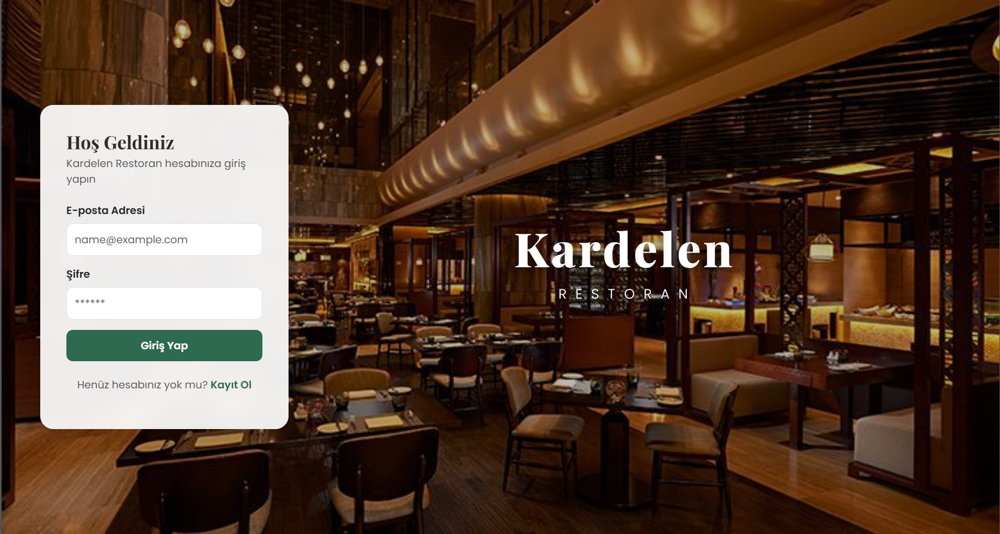
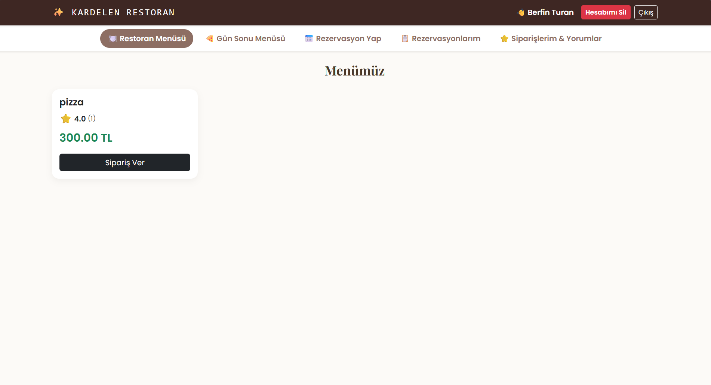
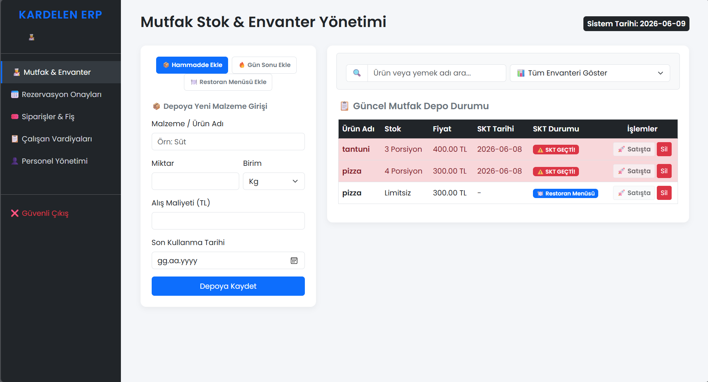

# Kardelen Restoran ERP ve Müşteri Yönetim Sistemi

Bu proje, Web Tabanlı Programlama dersi kapsamında yalın PHP (Vanilla PHP) ve MySQL kullanılarak geliştirilmiş, restoranlar için uçtan uca bir envanter, rezervasyon ve sipariş otomasyonudur. 

## 🚀 Proje Hakkında ve Temel İşlevler

Uygulama, müşteriler ve restoran personeli (yöneticiler) için iki farklı arayüz ve yetkilendirme sistemi sunar. Proje kapsamında veritabanı ilişkileri (JOIN işlemleri) ve tam kapsamlı CRUD (Create, Read, Update, Delete) operasyonları güvenli bir şekilde uygulanmıştır.

### 👥 Müşteri Paneli Özellikleri
* **Kimlik Doğrulama:** `session_start()` ile güvenli oturum yönetimi ve `password_hash()` ile şifrelenmiş kullanıcı kayıt sistemi.
* **Hesap Yönetimi:** Müşterinin kendi hesabını silmesi durumunda, ilişkili tüm rezervasyon ve sipariş verilerinin temizlenmesi (Delete).
* **Menü ve Gün Sonu Fırsatları:** Restoran menüsünü ve israfı önlemek amacıyla stok fazlası gün sonu yemeklerini listeleme (Read).
* **Sosyal Kanıt (Değerlendirme Sistemi):** Teslim alınan siparişlere 1-5 arası yıldız verme, yorum yapma (Update) ve yapılan yorumları kendi paneli üzerinden silebilme (Delete). Ürün kartlarında dinamik yıldız ortalaması görüntüleme.
* **Rezervasyon:** Gelecek tarihler için masa ayırtma (Create) ve personel onay durumunu takip etme.
* **Sipariş İptali:** Sadece henüz teslim edilmemiş statüdeki siparişleri iptal edebilme (Delete).

### 👨‍🍳 Personel (Yönetici) Paneli Özellikleri
* **Mutfak ve Stok Yönetimi:** Depoya yeni hammadde ekleme (Create), stoktan ürün silme (Delete) ve SKT'si (Son Kullanma Tarihi) yaklaşan hammaddeleri indirimli "Gün Sonu Menüsü"ne dönüştürerek satışa açma (Update).
* **Dinamik JS Filtreleme:** Sayfa yenilenmeden çalışan Vanilla JS arama motoru; SKT'si geçenleri, son 3 günü kalanları ve taze ürünleri anlık filtreleme (Read).
* **Adisyon ve Teslimat:** Siparişi müşteriye teslim etme (Update) ve JS `window.print()` API'si ile dinamik modal üzerinden Termal Adisyon Fişi yazdırma.
* **Rezervasyon Onay Masası:** Müşteri rezervasyonlarını inceleme, onaylama veya reddetme (Update).
* **Vardiya ve Personel Yönetimi:** Yeni yetkili personel hesapları oluşturma (Create), personelleri belirli saat aralıklarında görev alanlarına (Mutfak, Kasa vb.) atama (Create) ve vardiyadan çalışan kaldırma (Delete).

## 🛠️ Kullanılan Teknolojiler
* **Backend:** PHP 8.x (Yalın PHP, PDO/MySQLi)
* **Veritabanı:** MySQL / MariaDB
* **Frontend:** HTML5, CSS3, Bootstrap 5.3, Vanilla JavaScript
* **Mimari Yaklaşım:** PRG (Post-Redirect-Get) deseni, Session tabanlı güvenlik, Dinamik SQL JOIN operasyonları.

## 📸 Ekran Görüntüleri ve Görseller

* **Proje Arka Plan Görseli:** [Buradan Ulaşabilirsiniz]([https://i.pinimg.com/736x/da/5f/e1/da5fe156d4e90fe5e76c477cc7dc0ad8.jpg](https://tr.pinterest.com/pin/586453182767745158/)).
------------------------------

## 🎥 Proje Tanıtım Videosu
**[Tanıtım Videosunu İzle (Google Drive)](https://drive.google.com/file/d/1GpYuaPO1PZyBEmt1n1lc1M5VLkam1BIV/view?usp=sharing)**

---

### 👩‍💻 Geliştirici
**Berfin Turan** 
